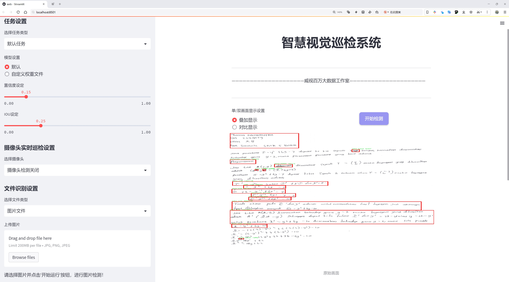
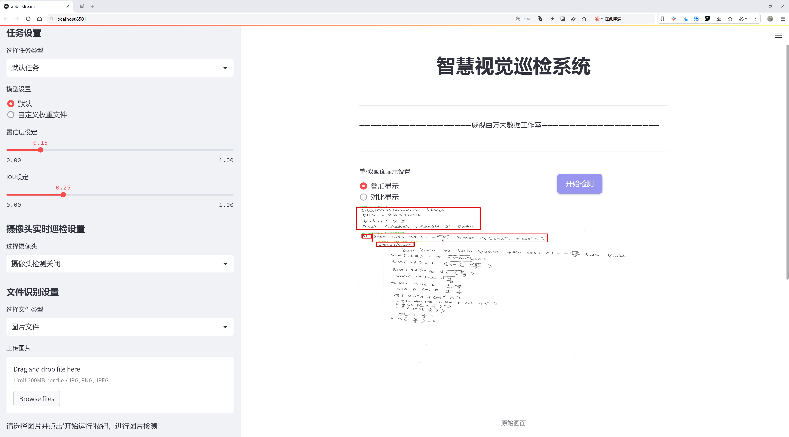
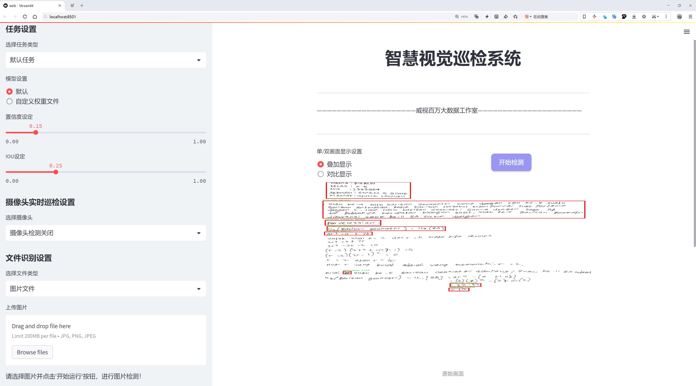
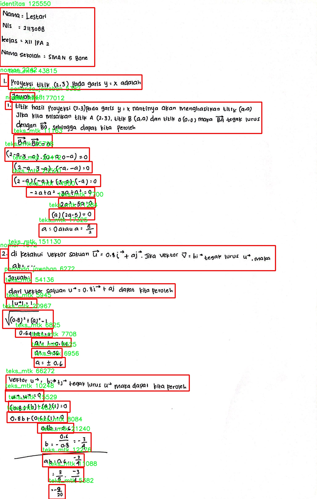
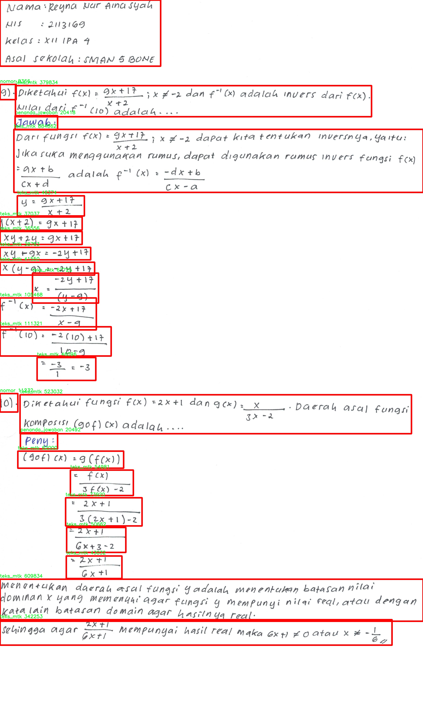
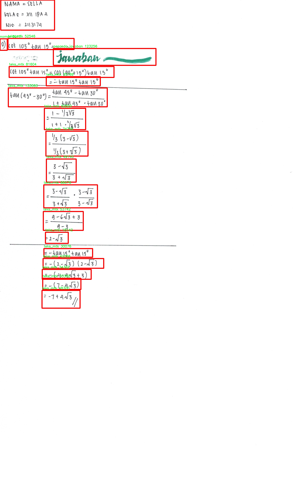
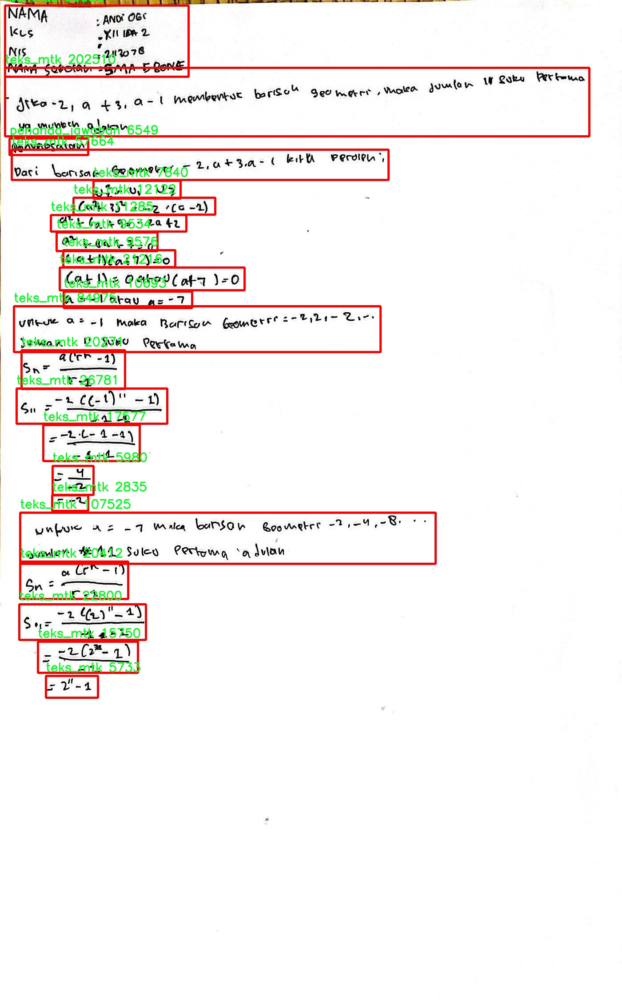
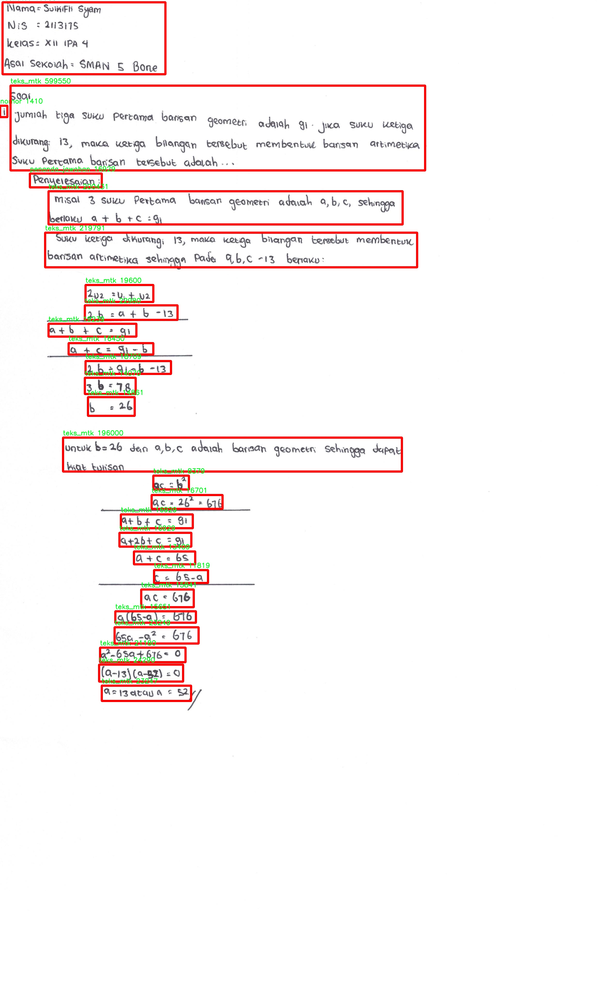

# 文档内容识别检测系统源码分享
 # [一条龙教学YOLOV8标注好的数据集一键训练_70+全套改进创新点发刊_Web前端展示]

### 1.研究背景与意义

项目参考[AAAI Association for the Advancement of Artificial Intelligence](https://gitee.com/qunshansj/projects)

项目来源[AACV Association for the Advancement of Computer Vision](https://gitee.com/qunmasj/projects)

研究背景与意义

随着信息技术的迅猛发展，文档内容识别技术在各个领域的应用愈发广泛，尤其是在教育、金融、法律等行业。传统的文档处理方式往往依赖人工审核，不仅效率低下，而且容易受到人为因素的影响，导致错误率上升。因此，开发高效、准确的文档内容识别系统成为了当前研究的热点之一。YOLO（You Only Look Once）系列模型因其高效的实时目标检测能力，逐渐成为文档内容识别领域的重要工具。YOLOv8作为该系列的最新版本，凭借其更为精细的特征提取能力和更快的推理速度，为文档内容识别提供了新的可能性。

在此背景下，基于改进YOLOv8的文档内容识别系统的研究具有重要的现实意义。首先，文档内容的自动识别能够显著提高信息处理的效率，尤其是在需要处理大量文档的场景中。例如，在教育领域，教师需要对学生的答卷进行评分，传统的人工评分方式不仅耗时长，而且容易受到主观因素的影响。通过引入基于YOLOv8的文档内容识别系统，可以实现对答卷中各类信息的自动提取与分析，从而提高评分的准确性和效率。

其次，针对特定数据集的训练与优化也是本研究的重要组成部分。我们所使用的数据集包含4600张图像，涵盖了6个类别，包括“gambar”（图像）、“identitas”（身份）、“nomor”（号码）、“penanda_jawaban”（答案标记）、“teks_mtk”（数学文本）和“teks_salah”（错误文本）。这些类别的多样性为模型的训练提供了丰富的样本，有助于提升系统的泛化能力和识别准确率。通过对YOLOv8模型的改进，可以更好地适应这些特定类别的特征，从而实现更高效的文档内容识别。

此外，随着社会对信息安全和隐私保护的重视，文档内容识别系统在确保数据安全方面的研究也显得尤为重要。通过改进YOLOv8模型，我们可以在提高识别精度的同时，设计出更为安全的文档处理流程，确保用户数据的隐私不被泄露。这不仅符合当前社会对信息安全的需求，也为文档内容识别技术的进一步发展提供了新的方向。

最后，基于改进YOLOv8的文档内容识别系统的研究将为相关领域的学术研究和技术应用提供重要的理论支持和实践参考。通过对模型的不断优化与迭代，我们期望能够推动文档内容识别技术的进步，为实现更智能化的信息处理提供坚实的基础。综上所述，本研究不仅具有重要的学术价值，也将为实际应用带来深远的影响。

### 2.图片演示







##### 注意：由于此博客编辑较早，上面“2.图片演示”和“3.视频演示”展示的系统图片或者视频可能为老版本，新版本在老版本的基础上升级如下：（实际效果以升级的新版本为准）

  （1）适配了YOLOV8的“目标检测”模型和“实例分割”模型，通过加载相应的权重（.pt）文件即可自适应加载模型。

  （2）支持“图片识别”、“视频识别”、“摄像头实时识别”三种识别模式。

  （3）支持“图片识别”、“视频识别”、“摄像头实时识别”三种识别结果保存导出，解决手动导出（容易卡顿出现爆内存）存在的问题，识别完自动保存结果并导出到tempDir中。

  （4）支持Web前端系统中的标题、背景图等自定义修改，后面提供修改教程。

  另外本项目提供训练的数据集和训练教程,暂不提供权重文件（best.pt）,需要您按照教程进行训练后实现图片演示和Web前端界面演示的效果。

### 3.视频演示

[3.1 视频演示](https://www.bilibili.com/video/BV1fbtaenEdB/)

### 4.数据集信息展示

##### 4.1 本项目数据集详细数据（类别数＆类别名）

nc: 6
names: ['gambar', 'identitas', 'nomor', 'penanda_jawaban', 'teks_mtk', 'teks_salah']


##### 4.2 本项目数据集信息介绍

数据集信息展示

在当今信息爆炸的时代，文档内容识别系统的有效性和准确性愈发重要。为了提升YOLOv8在文档内容识别任务中的表现，我们采用了名为“FULL 2”的数据集进行训练和评估。该数据集专为文档图像的多样性和复杂性而设计，涵盖了多种类别的文本元素，使其成为优化深度学习模型的理想选择。

“FULL 2”数据集包含六个主要类别，分别是：'gambar'（图像）、'identitas'（身份信息）、'nomor'（号码）、'penanda_jawaban'（答案标记）、'teks_mtk'（数学文本）和'teks_salah'（错误文本）。这些类别的设置不仅考虑了文档的结构特征，还兼顾了内容的语义信息，旨在为模型提供全面的训练样本，以增强其对不同文档元素的识别能力。

首先，'gambar'类别包含了文档中出现的各种图像。这些图像可能是图表、插图或其他视觉元素，能够为文本内容提供补充信息。通过训练模型识别这些图像，系统能够更好地理解文档的整体结构和信息层次，从而提升内容识别的准确性。

其次，'identitas'类别专注于文档中的身份信息，例如姓名、地址和其他个人信息。这一类别的样本通常具有较高的多样性，涵盖了不同的字体、排版和格式。通过对这一类别的训练，模型能够学习到如何在复杂的文档中提取关键信息，为后续的数据处理和分析提供支持。

'Nomor'类别则主要涉及各种数字信息，如电话号码、身份证号等。这些信息在许多文档中都是至关重要的，尤其是在需要进行身份验证或数据录入的场景中。通过对'Nomor'类别的训练，模型能够提高对数字信息的识别能力，确保在处理文档时不会遗漏重要的数据信息。

'Penanda_jawaban'类别包含了与答案相关的标记，通常出现在考试或问卷调查的文档中。这一类别的样本帮助模型学习如何识别和处理与答案相关的符号或标记，进而提升对文档内容的理解和分析能力。

'teks_mtk'和'teks_salah'类别则分别代表数学文本和错误文本。数学文本通常包含复杂的符号和公式，而错误文本则可能包含拼写错误或格式不规范的内容。这两个类别的样本不仅增加了数据集的多样性，还为模型提供了处理复杂文本和纠错的训练机会，进一步增强了其在实际应用中的鲁棒性。

综上所述，“FULL 2”数据集通过其丰富的类别设置和多样的样本，极大地提升了YOLOv8在文档内容识别任务中的训练效果。通过对不同类别的深入学习，模型能够更好地理解和处理复杂的文档信息，为实现高效的内容识别系统奠定了坚实的基础。随着数据集的不断优化和扩展，我们期待YOLOv8在文档内容识别领域取得更为显著的进展。











### 5.全套项目环境部署视频教程（零基础手把手教学）

[5.1 环境部署教程链接（零基础手把手教学）](https://www.ixigua.com/7404473917358506534?logTag=c807d0cbc21c0ef59de5)


[5.2 安装Python虚拟环境创建和依赖库安装视频教程链接（零基础手把手教学）](https://www.ixigua.com/7404474678003106304?logTag=1f1041108cd1f708b01a)

### 6.手把手YOLOV8训练视频教程（零基础小白有手就能学会）

[6.1 手把手YOLOV8训练视频教程（零基础小白有手就能学会）](https://www.ixigua.com/7404477157818401292?logTag=d31a2dfd1983c9668658)

### 7.70+种全套YOLOV8创新点代码加载调参视频教程（一键加载写好的改进模型的配置文件）

[7.1 70+种全套YOLOV8创新点代码加载调参视频教程（一键加载写好的改进模型的配置文件）](https://www.ixigua.com/7404478314661806627?logTag=29066f8288e3f4eea3a4)

### 8.70+种全套YOLOV8创新点原理讲解（非科班也可以轻松写刊发刊，V10版本正在科研待更新）

由于篇幅限制，每个创新点的具体原理讲解就不一一展开，具体见下列网址中的创新点对应子项目的技术原理博客网址【Blog】：


[8.1 70+种全套YOLOV8创新点原理讲解链接](https://gitee.com/qunmasj/good)

### 9.系统功能展示（检测对象为举例，实际内容以本项目数据集为准）

图9.1.系统支持检测结果表格显示

  图9.2.系统支持置信度和IOU阈值手动调节

  图9.3.系统支持自定义加载权重文件best.pt(需要你通过步骤5中训练获得)

  图9.4.系统支持摄像头实时识别

  图9.5.系统支持图片识别

  图9.6.系统支持视频识别

  图9.7.系统支持识别结果文件自动保存

  图9.8.系统支持Excel导出检测结果数据


### 10.原始YOLOV8算法原理

原始YOLOv8算法原理

YOLOv8作为YOLO系列的最新版本，代表了目标检测领域的一次重要进步。其设计理念旨在实现更高的检测精度和速度，尤其是在复杂环境下的应用。与之前的YOLO版本相比，YOLOv8采用了anchor-free的方法，显著减少了对预设锚框的依赖，从而提高了模型的灵活性和泛化能力。这一转变使得YOLOv8在处理多样化目标时表现得更加出色，尤其是在小目标检测和复杂背景下的目标识别。

YOLOv8的网络结构由四个主要模块组成：输入端、主干网络、Neck端和输出端。输入端负责对输入图像进行预处理，包括Mosaic数据增强、自适应图片缩放和灰度填充等操作。这些预处理步骤不仅提高了模型的训练效率，还增强了模型对不同场景的适应能力。Mosaic增强通过将多张图像拼接成一张新的训练样本，迫使模型学习不同的上下文信息，从而提升了目标检测的精度。

在主干网络部分，YOLOv8引入了C2F模块，替代了YOLOv5中的C3模块。C2F模块的设计灵感来源于YOLOv7中的ELAN模块，通过并行化更多的梯度流分支，YOLOv8能够在保持轻量化的同时，获得更丰富的特征信息。这种结构的优化使得YOLOv8在特征提取过程中，能够更好地捕捉到图像中的细节信息，从而提升了目标检测的准确性。

Neck端采用了PAN（Path Aggregation Network）结构，通过上采样和下采样的方式对不同尺度的特征图进行融合。这一设计不仅增强了模型对多尺度目标的感知能力，还提高了特征的表达能力。YOLOv8在Neck部分的改进，去除了多余的卷积层，直接对Backbone不同阶段输出的特征进行上采样，进一步提升了计算效率。

输出端则采用了Decoupled Head结构，将分类和回归过程解耦。这一设计的核心在于，通过两个独立的卷积模块分别处理分类和边界框回归任务，避免了以往Coupled Head结构中分类和回归共享卷积带来的信息干扰。这种解耦设计使得YOLOv8在进行目标检测时，能够更专注于各自的任务，提高了整体的检测性能。

在损失函数的设计上，YOLOv8采用了BCE（Binary Cross-Entropy）损失计算分类损失，并使用DFL（Distribution Focal Loss）和CIoU（Complete Intersection over Union）损失函数计算回归损失。这种组合的损失函数设计，使得模型在训练过程中能够更好地聚焦于目标边界的准确性，进而提升了检测的精度。

尽管YOLOv8在多个方面进行了优化，但在复杂水面环境下的应用仍然面临挑战。小目标漂浮物的特征复杂，背景多样，导致YOLOv8在这些场景下可能出现定位误差和对目标感知能力不足的问题。为了解决这些问题，研究者们提出了YOLOv8-WSSOD算法的改进方案，旨在进一步提升YOLOv8在复杂环境下的表现。

YOLOv8-WSSOD算法的改进主要体现在三个方面。首先，为了减轻主干网络下采样过程中的噪声影响，研究者引入了捕获远程依赖的思想，采用BiFormer双层路由注意力机制构建C2fBF模块。这一模块能够在特征提取过程中保留更细粒度的上下文信息，从而提升模型对复杂背景下小目标的感知能力。

其次，针对小目标漏检问题，YOLOv8-WSSOD在网络中添加了一个更小的检测头，以提升网络对小目标的感知力。同时，在Neck端引入GSConv和Slim-neck技术，旨在保持模型的检测精度的同时，降低计算量。这一改进不仅提高了模型的检测效率，还增强了其在复杂环境下的适应能力。

最后，YOLOv8-WSSOD使用MPDIoU损失函数替换了CIoU损失函数，以提高模型的泛化能力和精准度。MPDIoU损失函数通过考虑目标的多种几何信息，能够更准确地评估目标的定位精度，从而进一步提升模型在复杂场景下的表现。

综上所述，YOLOv8算法通过其创新的网络结构和优化的损失函数设计，在目标检测领域展现出了强大的性能。尽管在复杂环境下仍存在一些挑战，但通过进一步的改进和优化，YOLOv8及其衍生版本有望在未来的应用中实现更高的检测精度和更快的推理速度，为目标检测技术的发展做出更大的贡献。


### 11.项目核心源码讲解（再也不用担心看不懂代码逻辑）

#### 11.1 ui.py

以下是代码中最核心的部分，并附上详细的中文注释：

```python
import sys
import subprocess

def run_script(script_path):
    """
    使用当前 Python 环境运行指定的脚本。

    Args:
        script_path (str): 要运行的脚本路径

    Returns:
        None
    """
    # 获取当前 Python 解释器的路径
    python_path = sys.executable

    # 构建运行命令，使用 streamlit 运行指定的脚本
    command = f'"{python_path}" -m streamlit run "{script_path}"'

    # 执行命令
    result = subprocess.run(command, shell=True)
    # 检查命令执行的返回码，如果不为0则表示出错
    if result.returncode != 0:
        print("脚本运行出错。")

# 实例化并运行应用
if __name__ == "__main__":
    # 指定要运行的脚本路径
    script_path = "web.py"  # 这里可以直接指定脚本名，假设它在当前目录下

    # 调用函数运行脚本
    run_script(script_path)
```

### 代码注释说明：
1. **导入模块**：
   - `sys`：用于访问与 Python 解释器相关的变量和函数。
   - `subprocess`：用于执行外部命令和程序。

2. **`run_script` 函数**：
   - 该函数接受一个参数 `script_path`，表示要运行的 Python 脚本的路径。
   - 使用 `sys.executable` 获取当前 Python 解释器的路径，以确保使用正确的 Python 环境来运行脚本。
   - 构建一个命令字符串，使用 `streamlit` 模块来运行指定的脚本。
   - 使用 `subprocess.run` 执行构建的命令，并通过 `shell=True` 允许在 shell 中执行命令。
   - 检查命令的返回码，如果返回码不为0，表示脚本运行出错，并打印错误信息。

3. **主程序块**：
   - 通过 `if __name__ == "__main__":` 确保该代码块仅在直接运行脚本时执行。
   - 指定要运行的脚本路径（在这里是 `web.py`）。
   - 调用 `run_script` 函数来执行指定的脚本。

这个程序文件名为 `ui.py`，其主要功能是通过当前的 Python 环境运行一个指定的脚本，具体来说是一个名为 `web.py` 的脚本。程序首先导入了必要的模块，包括 `sys`、`os` 和 `subprocess`，这些模块提供了与系统交互的功能，尤其是执行外部命令的能力。

在文件中定义了一个名为 `run_script` 的函数，该函数接受一个参数 `script_path`，这个参数是要运行的脚本的路径。函数内部首先获取当前 Python 解释器的路径，这通过 `sys.executable` 实现。接着，程序构建了一个命令字符串，使用 `streamlit` 来运行指定的脚本。这个命令的格式是将 Python 解释器的路径与 `-m streamlit run` 和脚本路径结合在一起。

然后，程序使用 `subprocess.run` 方法来执行这个命令。`shell=True` 参数允许在 shell 中执行命令。执行完命令后，程序检查返回的结果码，如果结果码不为零，表示脚本运行过程中出现了错误，程序会打印出“脚本运行出错”的提示信息。

在文件的最后部分，使用了一个 `if __name__ == "__main__":` 的条件判断，这意味着只有当这个文件被直接运行时，以下代码才会被执行。在这个代码块中，首先调用 `abs_path` 函数来获取 `web.py` 的绝对路径，然后调用 `run_script` 函数来运行这个脚本。

总体来说，这个程序的主要作用是方便地通过当前的 Python 环境来运行一个 Streamlit 应用脚本，并处理可能出现的错误。

#### 11.2 code\ultralytics\utils\__init__.py

以下是经过简化和注释的核心代码部分，主要保留了重要的功能和设置：

```python
import os
import platform
import logging
from pathlib import Path
import torch
import yaml

# 设置 PyTorch 打印选项
torch.set_printoptions(linewidth=320, precision=4, profile="default")

# 定义常量
ROOT = Path(__file__).resolve().parents[1]  # 项目根目录
DEFAULT_CFG_PATH = ROOT / "cfg/default.yaml"  # 默认配置文件路径

# 设置日志记录
def set_logging(name="ultralytics", verbose=True):
    """设置日志记录，包括编码和输出级别"""
    level = logging.INFO if verbose else logging.ERROR  # 根据 verbose 设置日志级别
    logging.basicConfig(level=level, format='%(message)s')  # 配置日志格式
    logger = logging.getLogger(name)  # 获取日志记录器
    return logger

# 加载 YAML 配置文件
def yaml_load(file="data.yaml"):
    """从 YAML 文件加载数据"""
    with open(file, errors="ignore", encoding="utf-8") as f:
        return yaml.safe_load(f) or {}  # 返回字典，确保即使文件为空也返回空字典

# 默认配置加载
DEFAULT_CFG_DICT = yaml_load(DEFAULT_CFG_PATH)  # 加载默认配置
DEFAULT_CFG = {k: v for k, v in DEFAULT_CFG_DICT.items()}  # 转换为字典

# 检查操作系统类型
def is_ubuntu() -> bool:
    """检查当前操作系统是否为 Ubuntu"""
    return platform.system() == "Linux" and "ubuntu" in platform.uname().release.lower()

# 检查是否在 Docker 中运行
def is_docker() -> bool:
    """检查当前脚本是否在 Docker 容器中运行"""
    return Path("/proc/self/cgroup").exists() and "docker" in open("/proc/self/cgroup").read()

# 主程序入口
if __name__ == "__main__":
    LOGGER = set_logging()  # 设置日志记录器
    LOGGER.info("Ultralytics initialized.")  # 打印初始化信息
```

### 代码注释说明：
1. **导入模块**：导入了必要的库，包括 `os`、`platform`、`logging`、`Path`、`torch` 和 `yaml`。
2. **设置 PyTorch 打印选项**：配置 PyTorch 的打印格式，以便于调试和查看输出。
3. **定义常量**：设置项目的根目录和默认配置文件的路径。
4. **日志记录设置**：定义了一个 `set_logging` 函数，用于配置日志记录的名称和输出级别。
5. **YAML 文件加载**：定义了 `yaml_load` 函数，从指定的 YAML 文件中加载数据，并确保返回一个字典。
6. **默认配置加载**：从默认配置文件中加载配置，并将其转换为字典格式。
7. **操作系统检查**：定义了 `is_ubuntu` 和 `is_docker` 函数，用于检查当前操作系统类型和是否在 Docker 中运行。
8. **主程序入口**：在脚本运行时，设置日志记录器并打印初始化信息。

这个简化版本保留了核心功能，并提供了必要的注释，以帮助理解代码的目的和功能。

这个程序文件是Ultralytics YOLO库的初始化模块，主要负责设置环境、配置、工具函数和类的定义，以支持YOLO模型的训练、验证和推理等功能。

首先，文件导入了一系列必要的库，包括标准库和第三方库，如`cv2`、`torch`、`yaml`等。接着，定义了一些常量，例如多GPU训练的环境变量、文件路径、线程数等。这些常量为后续的功能提供了基础配置。

文件中还包含了帮助信息，说明如何使用YOLOv8，包括如何安装库、使用Python SDK和命令行接口（CLI）进行模型训练、验证和预测等操作。这些信息对于用户快速上手非常有帮助。

在设置部分，文件配置了打印选项、OpenCV的线程数、NumExpr的最大线程数等，以优化性能和输出格式。同时，定义了一个自定义的`tqdm`类，用于显示进度条，提供更好的用户体验。

接下来，定义了一些工具类和函数，例如`SimpleClass`和`IterableSimpleNamespace`，这些类提供了方便的字符串表示和属性访问功能，便于调试和使用。还有一些函数用于处理YAML文件的读写、打印、以及设置图形绘制的参数等。

文件还定义了一些检查函数，用于判断当前运行环境，例如是否在Ubuntu、Colab、Kaggle、Jupyter或Docker中运行。这些函数帮助程序根据不同的环境做出相应的调整。

此外，文件中还实现了与Git相关的功能，例如获取Git目录、获取Git的origin URL和当前分支等。这些功能可以帮助用户在版本控制方面更好地管理项目。

最后，文件执行了一些初始化操作，包括检查安装、设置用户配置目录、初始化日志记录、设置Sentry错误跟踪等。这些步骤确保了程序在启动时具备必要的环境和配置。

总的来说，这个初始化模块为Ultralytics YOLO库提供了基础设施，确保模型的训练和推理能够在各种环境中顺利进行。

#### 11.3 train.py

以下是经过简化和注释的核心代码部分，主要保留了训练检测模型的关键功能：

```python
import random
import numpy as np
import torch.nn as nn
from ultralytics.data import build_dataloader, build_yolo_dataset
from ultralytics.engine.trainer import BaseTrainer
from ultralytics.models import yolo
from ultralytics.nn.tasks import DetectionModel
from ultralytics.utils import LOGGER, RANK
from ultralytics.utils.torch_utils import de_parallel, torch_distributed_zero_first

class DetectionTrainer(BaseTrainer):
    """
    基于检测模型的训练类，继承自BaseTrainer类。
    """

    def build_dataset(self, img_path, mode="train", batch=None):
        """
        构建YOLO数据集。

        参数:
            img_path (str): 包含图像的文件夹路径。
            mode (str): 模式，'train'表示训练模式，'val'表示验证模式。
            batch (int, optional): 批次大小，仅用于'rect'模式。默认为None。
        """
        gs = max(int(de_parallel(self.model).stride.max() if self.model else 0), 32)  # 获取模型的最大步幅
        return build_yolo_dataset(self.args, img_path, batch, self.data, mode=mode, rect=mode == "val", stride=gs)

    def get_dataloader(self, dataset_path, batch_size=16, rank=0, mode="train"):
        """构建并返回数据加载器。"""
        assert mode in ["train", "val"]  # 确保模式有效
        with torch_distributed_zero_first(rank):  # 在分布式环境中，确保数据集只初始化一次
            dataset = self.build_dataset(dataset_path, mode, batch_size)
        shuffle = mode == "train"  # 训练模式下打乱数据
        workers = self.args.workers if mode == "train" else self.args.workers * 2  # 根据模式设置工作线程数
        return build_dataloader(dataset, batch_size, workers, shuffle, rank)  # 返回数据加载器

    def preprocess_batch(self, batch):
        """对图像批次进行预处理，包括缩放和转换为浮点数。"""
        batch["img"] = batch["img"].to(self.device, non_blocking=True).float() / 255  # 转换为浮点数并归一化
        if self.args.multi_scale:  # 如果启用多尺度
            imgs = batch["img"]
            sz = (
                random.randrange(self.args.imgsz * 0.5, self.args.imgsz * 1.5 + self.stride)
                // self.stride
                * self.stride
            )  # 随机选择新的尺寸
            sf = sz / max(imgs.shape[2:])  # 计算缩放因子
            if sf != 1:
                ns = [
                    math.ceil(x * sf / self.stride) * self.stride for x in imgs.shape[2:]
                ]  # 计算新的形状
                imgs = nn.functional.interpolate(imgs, size=ns, mode="bilinear", align_corners=False)  # 进行插值
            batch["img"] = imgs  # 更新批次图像
        return batch

    def get_model(self, cfg=None, weights=None, verbose=True):
        """返回YOLO检测模型。"""
        model = DetectionModel(cfg, nc=self.data["nc"], verbose=verbose and RANK == -1)  # 创建检测模型
        if weights:
            model.load(weights)  # 加载权重
        return model

    def plot_training_samples(self, batch, ni):
        """绘制带有注释的训练样本。"""
        plot_images(
            images=batch["img"],
            batch_idx=batch["batch_idx"],
            cls=batch["cls"].squeeze(-1),
            bboxes=batch["bboxes"],
            paths=batch["im_file"],
            fname=self.save_dir / f"train_batch{ni}.jpg",
            on_plot=self.on_plot,
        )

    def plot_metrics(self):
        """从CSV文件中绘制指标。"""
        plot_results(file=self.csv, on_plot=self.on_plot)  # 保存结果图
```

### 代码注释说明：
1. **类和方法定义**：`DetectionTrainer`类继承自`BaseTrainer`，用于处理YOLO模型的训练过程。
2. **数据集构建**：`build_dataset`方法负责根据输入路径和模式构建YOLO数据集，支持训练和验证模式。
3. **数据加载器**：`get_dataloader`方法构建数据加载器，支持多线程和数据打乱。
4. **批次预处理**：`preprocess_batch`方法对输入的图像批次进行预处理，包括归一化和可选的多尺度调整。
5. **模型获取**：`get_model`方法用于创建YOLO检测模型并加载预训练权重。
6. **可视化**：`plot_training_samples`和`plot_metrics`方法用于可视化训练样本和训练指标，便于监控训练过程。

这个程序文件 `train.py` 是一个用于训练目标检测模型的脚本，主要基于 YOLO（You Only Look Once）架构。它继承自 `BaseTrainer` 类，提供了一系列用于构建数据集、数据加载、模型训练和评估的功能。

在文件的开头，导入了一些必要的库和模块，包括数学运算、随机数生成、深度学习相关的库以及 YOLO 相关的工具和模型。这些导入为后续的功能实现提供了基础。

`DetectionTrainer` 类是该文件的核心，包含了多个方法来支持训练过程。首先，`build_dataset` 方法用于构建 YOLO 数据集，接收图像路径、模式（训练或验证）和批量大小作为参数。它通过调用 `build_yolo_dataset` 函数来创建数据集，支持不同模式下的增强操作。

`get_dataloader` 方法用于构建数据加载器，确保在分布式训练中只初始化一次数据集。它根据模式设置是否打乱数据，并返回构建好的数据加载器。

`preprocess_batch` 方法对输入的图像批次进行预处理，包括将图像缩放到合适的大小并转换为浮点数格式。这个方法还支持多尺度训练，通过随机选择图像大小来增强模型的鲁棒性。

`set_model_attributes` 方法用于设置模型的属性，包括类别数量和类别名称等。它确保模型在训练前正确配置。

`get_model` 方法返回一个 YOLO 检测模型，支持加载预训练权重。`get_validator` 方法则返回一个用于模型验证的验证器。

`label_loss_items` 方法用于返回带有标签的训练损失项字典，这对于目标检测和分割任务是必要的。`progress_string` 方法返回一个格式化的字符串，显示训练进度，包括当前的轮次、GPU 内存使用情况和损失值等。

`plot_training_samples` 方法用于绘制训练样本及其标注，便于可视化训练过程中的数据。`plot_metrics` 和 `plot_training_labels` 方法则用于绘制训练过程中的指标和标签，帮助用户分析模型的训练效果。

总体而言，这个程序文件实现了一个完整的目标检测模型训练流程，涵盖了数据准备、模型构建、训练过程监控和结果可视化等多个方面，适合用于 YOLO 模型的训练和评估。

#### 11.4 70+种YOLOv8算法改进源码大全和调试加载训练教程（非必要）\ultralytics\utils\plotting.py

以下是经过简化和注释的核心代码部分，主要集中在 `Colors` 和 `Annotator` 类上，以及一些重要的绘图函数。

```python
import numpy as np
from PIL import Image, ImageDraw, ImageFont
import cv2

class Colors:
    """
    颜色类，用于处理颜色调色板。
    """

    def __init__(self):
        """初始化颜色调色板，包含默认的颜色值。"""
        # 定义一组十六进制颜色
        hexs = ('FF3838', 'FF9D97', 'FF701F', 'FFB21D', 'CFD231', 
                '48F90A', '92CC17', '3DDB86', '1A9334', '00D4BB',
                '2C99A8', '00C2FF', '344593', '6473FF', '0018EC', 
                '8438FF', '520085', 'CB38FF', 'FF95C8', 'FF37C7')
        # 将十六进制颜色转换为RGB格式
        self.palette = [self.hex2rgb(f'#{c}') for c in hexs]
        self.n = len(self.palette)  # 颜色数量

    def __call__(self, i, bgr=False):
        """根据索引返回颜色，支持BGR格式。"""
        c = self.palette[int(i) % self.n]  # 获取颜色
        return (c[2], c[1], c[0]) if bgr else c  # 如果需要BGR格式则反转

    @staticmethod
    def hex2rgb(h):
        """将十六进制颜色转换为RGB格式。"""
        return tuple(int(h[1 + i:1 + i + 2], 16) for i in (0, 2, 4))


class Annotator:
    """
    注释类，用于在图像上绘制框、文本和关键点。
    """

    def __init__(self, im, line_width=None, font_size=None, font='Arial.ttf', pil=False):
        """初始化Annotator类，设置图像和绘制参数。"""
        self.im = im if isinstance(im, Image.Image) else Image.fromarray(im)  # 转换为PIL图像
        self.draw = ImageDraw.Draw(self.im)  # 创建绘图对象
        self.lw = line_width or 2  # 设置线宽
        self.font = ImageFont.truetype(font, font_size or 12)  # 设置字体

    def box_label(self, box, label='', color=(128, 128, 128), txt_color=(255, 255, 255)):
        """在图像上绘制边框和标签。"""
        self.draw.rectangle(box, width=self.lw, outline=color)  # 绘制边框
        if label:
            w, h = self.font.getsize(label)  # 获取文本尺寸
            self.draw.rectangle((box[0], box[1] - h, box[0] + w + 1, box[1] + 1), fill=color)  # 绘制标签背景
            self.draw.text((box[0], box[1] - h), label, fill=txt_color, font=self.font)  # 绘制文本

    def result(self):
        """返回注释后的图像。"""
        return np.asarray(self.im)  # 转换为numpy数组


def plot_labels(boxes, cls, names=(), save_dir=''):
    """绘制训练标签，包括类直方图和框统计信息。"""
    import pandas as pd
    import seaborn as sn
    import matplotlib.pyplot as plt

    # 限制框的数量
    boxes = boxes[:1000000]
    x = pd.DataFrame(boxes, columns=['x', 'y', 'width', 'height'])  # 创建数据框

    # 绘制直方图
    plt.figure(figsize=(8, 8))
    ax = plt.subplot(2, 2, 1)
    ax.hist(cls, bins=np.arange(cls.max() + 2) - 0.5, rwidth=0.8)  # 类直方图
    ax.set_ylabel('instances')

    # 保存图像
    plt.savefig(f"{save_dir}/labels.jpg", dpi=200)
    plt.close()
```

### 代码注释说明：
1. **Colors 类**：
   - 负责管理颜色调色板，支持将十六进制颜色转换为RGB格式。
   - 提供了通过索引获取颜色的功能，支持BGR格式。

2. **Annotator 类**：
   - 用于在图像上绘制边框、文本和关键点。
   - 提供了绘制边框和标签的功能，能够处理PIL图像。

3. **plot_labels 函数**：
   - 绘制训练标签的直方图和框统计信息，并保存为图像文件。

通过这些核心部分和注释，可以理解代码的主要功能和结构。

这个程序文件是一个用于YOLOv8算法的可视化和绘图工具，主要用于处理图像标注、绘制训练结果、可视化特征图等功能。文件中定义了多个类和函数，下面是对其主要内容的说明。

首先，文件导入了一些必要的库，包括用于图像处理的OpenCV、PIL和Matplotlib，以及用于数值计算的NumPy和PyTorch。接着，定义了一个`Colors`类，该类用于管理Ultralytics的默认颜色调色板，提供了将十六进制颜色代码转换为RGB值的方法。

接下来，定义了一个`Annotator`类，用于在图像上添加标注。该类的构造函数接受图像、线宽、字体等参数，并根据选择使用PIL或OpenCV进行绘制。`Annotator`类提供了多种方法，包括绘制边框、添加文本、绘制关键点和掩膜等，支持对图像进行详细的标注。

在`Annotator`类中，`box_label`方法用于在图像上绘制矩形框和标签，`masks`方法用于在图像上绘制掩膜，`kpts`方法用于绘制关键点和连接线，`rectangle`和`text`方法用于绘制矩形和文本。

此外，文件中还定义了一些函数，如`plot_labels`用于绘制训练标签的统计信息，`save_one_box`用于根据给定的边界框保存图像的裁剪部分，`plot_images`用于绘制带有标签的图像网格，`plot_results`用于从CSV文件中绘制训练结果。

`output_to_target`函数用于将模型输出转换为目标格式，以便于绘图。`feature_visualization`函数则用于可视化模型推理过程中的特征图。

总的来说，这个文件提供了一整套用于YOLOv8模型训练和推理过程中图像标注和结果可视化的工具，方便用户进行模型评估和结果分析。

#### 11.5 70+种YOLOv8算法改进源码大全和调试加载训练教程（非必要）\ultralytics\models\nas\val.py

以下是经过简化和注释的核心代码部分：

```python
import torch
from ultralytics.utils import ops

class NASValidator:
    """
    YOLO NAS 验证器，用于目标检测的后处理。

    该类用于处理 YOLO NAS 模型生成的原始预测结果，执行非极大值抑制（NMS）以去除重叠和低置信度的框，
    最终生成最终的检测结果。
    """

    def postprocess(self, preds_in):
        """对预测输出应用非极大值抑制（NMS）。"""
        # 将预测框从 xyxy 格式转换为 xywh 格式
        boxes = ops.xyxy2xywh(preds_in[0][0])
        
        # 将框和置信度合并，并调整维度
        preds = torch.cat((boxes, preds_in[0][1]), -1).permute(0, 2, 1)
        
        # 应用非极大值抑制，去除重叠的框
        return ops.non_max_suppression(preds,
                                       self.args.conf,  # 置信度阈值
                                       self.args.iou,   # IoU 阈值
                                       labels=self.lb,  # 多标签 NMS 的标签
                                       multi_label=False,  # 是否支持多标签
                                       agnostic=self.args.single_cls,  # 是否类别无关
                                       max_det=self.args.max_det,  # 最大检测框数量
                                       max_time_img=0.5)  # 每张图像的最大处理时间
```

### 代码说明：
1. **导入必要的库**：
   - `torch`：用于张量操作。
   - `ops`：包含一些操作函数，例如坐标转换和非极大值抑制。

2. **NASValidator 类**：
   - 该类负责处理 YOLO NAS 模型的预测结果，主要功能是去除重叠的检测框。

3. **postprocess 方法**：
   - 输入参数 `preds_in` 是模型的原始预测结果。
   - 首先将预测框的坐标格式从 `xyxy`（左上角和右下角坐标）转换为 `xywh`（中心坐标和宽高）。
   - 然后将框和对应的置信度合并为一个张量，并调整其维度以适应后续处理。
   - 最后，调用 `non_max_suppression` 函数进行非极大值抑制，去除重叠和低置信度的框，返回最终的检测结果。

该程序文件是Ultralytics YOLO（You Only Look Once）模型的一部分，主要用于YOLO NAS（Neural Architecture Search）模型的后处理，具体实现了一个名为`NASValidator`的类。该类继承自`DetectionValidator`，用于处理YOLO NAS模型生成的原始预测结果。

在类的文档字符串中，首先说明了该类的用途，即对YOLO NAS模型的预测结果进行后处理，特别是执行非极大值抑制（Non-Maximum Suppression, NMS），以去除重叠和低置信度的边界框，从而生成最终的检测结果。该类还包含一些属性，例如`args`，这是一个命名空间，包含了后处理的各种配置参数，如置信度和IoU（Intersection over Union）阈值；`lb`是一个可选的张量，用于多标签NMS。

在使用示例中，首先从`ultralytics`库中导入`NAS`类，然后创建一个YOLO NAS模型的实例，接着获取该模型的验证器（validator）。在假设已经有原始预测结果的情况下，调用`postprocess`方法对这些结果进行处理，得到最终的预测结果。

`postprocess`方法是该类的核心功能，接收原始预测输入`preds_in`，并应用非极大值抑制。具体实现中，首先将预测框的坐标从xyxy格式转换为xywh格式，然后将边界框和相应的置信度合并，最后调用`ops.non_max_suppression`方法进行NMS处理，返回最终的检测结果。该方法的参数包括置信度阈值、IoU阈值、标签、是否多标签处理、是否类别无关、最大检测数量以及每张图像的最大处理时间等。

总体而言，该文件提供了YOLO NAS模型后处理的实现，确保生成的检测结果更为准确和有效。

#### 11.6 70+种YOLOv8算法改进源码大全和调试加载训练教程（非必要）\ultralytics\trackers\__init__.py

以下是经过简化和注释后的核心代码部分：

```python
# 导入所需的跟踪器类
from .bot_sort import BOTSORT  # 导入 BOTSORT 跟踪器
from .byte_tracker import BYTETracker  # 导入 BYTETracker 跟踪器
from .track import register_tracker  # 导入注册跟踪器的函数

# 定义模块的公共接口，允许其他模块简单导入
__all__ = 'register_tracker', 'BOTSORT', 'BYTETracker'  # 指定可以被外部导入的类和函数
```

### 详细注释：
1. **导入模块**：
   - `from .bot_sort import BOTSORT`：从当前包中导入 `BOTSORT` 类，用于目标跟踪。
   - `from .byte_tracker import BYTETracker`：从当前包中导入 `BYTETracker` 类，另一种目标跟踪实现。
   - `from .track import register_tracker`：从当前包中导入 `register_tracker` 函数，用于注册跟踪器。

2. **定义公共接口**：
   - `__all__` 是一个特殊变量，用于定义当使用 `from module import *` 时，哪些名称是可以被导入的。在这里，`register_tracker`、`BOTSORT` 和 `BYTETracker` 被列为公共接口，允许其他模块简单地导入这些类和函数。

这个程序文件是Ultralytics YOLO项目中的一个初始化文件，位于`trackers`目录下，文件名为`__init__.py`。该文件的主要作用是定义模块的公共接口和导入相关的跟踪器类。

首先，文件开头的注释`# Ultralytics YOLO 🚀, AGPL-3.0 license`表明这是Ultralytics YOLO项目的一部分，并且使用的是AGPL-3.0许可证，这意味着该代码可以自由使用和修改，但需要遵循相应的开源协议。

接下来，文件通过相对导入的方式引入了三个模块：`BOTSORT`、`BYTETracker`和`register_tracker`。这些模块分别对应不同的跟踪算法和注册功能。其中，`BOTSORT`和`BYTETracker`是具体的跟踪器实现，而`register_tracker`则是一个用于注册跟踪器的函数。

最后，`__all__`变量被定义为一个包含字符串的元组，列出了该模块公开的接口，包括`register_tracker`、`BOTSORT`和`BYTETracker`。这意味着当使用`from <module> import *`的方式导入该模块时，只会导入这些指定的对象，从而控制了模块的公共接口，避免不必要的名称冲突。

总的来说，这个`__init__.py`文件为YOLOv8的跟踪功能提供了一个简洁的接口，使得用户可以方便地使用和扩展不同的跟踪算法。

### 12.系统整体结构（节选）

### 整体功能和构架概括

该程序整体上是一个基于YOLO（You Only Look Once）架构的目标检测和跟踪系统，主要用于实现YOLOv8模型的训练、验证、推理和结果可视化。它的构架包括多个模块和工具，涵盖了数据处理、模型训练、后处理、可视化和跟踪等功能。以下是各个模块的主要功能：

1. **模型训练**：通过`train.py`实现YOLOv8模型的训练流程，包括数据集构建、数据加载、模型训练和评估。
2. **后处理**：`val.py`和其他相关文件负责处理模型的输出结果，应用非极大值抑制等技术来优化检测结果。
3. **可视化**：`plotting.py`提供了图像标注和训练结果可视化的工具，帮助用户分析模型性能。
4. **跟踪功能**：`trackers`模块实现了不同的目标跟踪算法，支持在视频流中对目标进行实时跟踪。
5. **工具和实用程序**：`utils`和其他辅助模块提供了数据处理、配置管理和环境设置等功能，支持整个系统的运行。

### 文件功能整理表

| 文件路径                                                                                     | 功能描述                                               |
|---------------------------------------------------------------------------------------------|------------------------------------------------------|
| `code\__init__.py`                                                                          | 初始化模块，定义公共接口和导入相关子模块。               |
| `code\ui.py`                                                                                | 运行指定的Streamlit应用脚本，提供用户界面功能。          |
| `code\ultralytics\utils\__init__.py`                                                       | 初始化工具模块，导入和配置工具函数和类。                 |
| `code\train.py`                                                                             | 实现YOLOv8模型的训练流程，包括数据集构建和训练监控。       |
| `70+种YOLOv8算法改进源码大全和调试加载训练教程（非必要）\ultralytics\utils\plotting.py`   | 提供图像标注和训练结果可视化工具，支持结果分析。           |
| `70+种YOLOv8算法改进源码大全和调试加载训练教程（非必要）\ultralytics\models\nas\val.py` | 实现YOLO NAS模型的后处理，应用非极大值抑制。              |
| `70+种YOLOv8算法改进源码大全和调试加载训练教程（非必要）\ultralytics\trackers\__init__.py` | 初始化跟踪器模块，导入不同的跟踪算法和注册功能。          |
| `70+种YOLOv8算法改进源码大全和调试加载训练教程（非必要）\ultralytics\hub\auth.py`      | 处理与Ultralytics Hub的身份验证相关的功能。               |
| `code\ultralytics\models\rtdetr\val.py`                                                    | 实现RT-DETR模型的验证功能，处理模型输出。                 |
| `70+种YOLOv8算法改进源码大全和调试加载训练教程（非必要）\ultralytics\engine\results.py`  | 处理模型推理结果，支持结果的格式化和保存。                |
| `code\ultralytics\trackers\utils\gmc.py`                                                   | 提供与跟踪相关的工具函数，支持跟踪算法的实现。             |
| `code\ultralytics\data\utils.py`                                                           | 提供数据处理和加载的实用工具函数，支持数据集的构建和管理。 |

这个表格总结了每个文件的主要功能，帮助理解整个YOLOv8项目的结构和功能模块。

注意：由于此博客编辑较早，上面“11.项目核心源码讲解（再也不用担心看不懂代码逻辑）”中部分代码可能会优化升级，仅供参考学习，完整“训练源码”、“Web前端界面”和“70+种创新点源码”以“13.完整训练+Web前端界面+70+种创新点源码、数据集获取”的内容为准。

### 13.完整训练+Web前端界面+70+种创新点源码、数据集获取


# [下载链接：D:\tools\20240905\Temporary](D:\tools\20240905\Temporary)